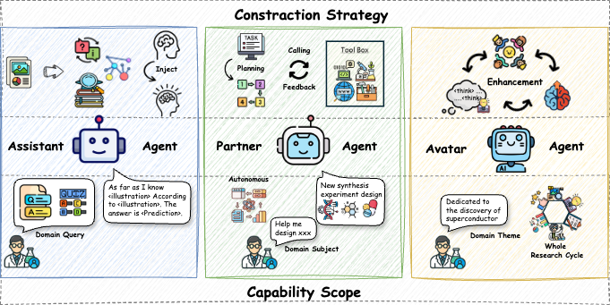

# Awesome-Scientific-Agent

## ✨ Introduction

The advancement of LLM-based agents heralds a new perspective for AI for Science (AI4S), automation science research. Prominent large language models have exhibited expertise across multiple domains, prompting researchers to develop agents for the natural sciences and investigate the frontiers of scientific knowledge. Nevertheless, the divergences between the natural sciences and AI have hindered the development and advancement of scientific agents across various fields. This survey is grounded in the standardized scientific research process and elucidates the construction and evaluation of scientific agents.

* We elucidate the objective orientation of scientific research agents, which directly guides the construction for scientific agents.
* We systematically taxonomizing existing scientific research agents into three levels, with show strong hierarchical characteristics in terms of construction strategy and capability scope.
* We provides substantial and detailed answers to the questions of "how to construct a scientific agent from scratch" and "how to enhance the capabilities of existing scientific agents".

## 📖 Framework

  * [Taxonomy](#Taxonomy)
  * [Scientific Agent Construction](#scientific-agent-construction)
  * [Scientific Agent Enhancement](#scientific-agent-enhancement)
  * [Benchmarks For Scientific Agent](#benchmark-for-scientific-agent)

## 💡Taxonomy

### Level 1: Agent As Assistant

- **AstroLLaMA‑Chat: Scaling AstroLLaMA with Conversational and Diverse Datasets** — 
- **BioGPT: Generative Pre‑trained Transformer for Biomedical Text Generation and Mining** — 
- **DARWIN 1.5: Large Language Models as Materials‑Science Foundation Models** — 
- **ChemBERTa: Large‑Scale Self‑Supervised Pre‑training for Molecular Property Prediction** — 
- **ChemAU: Harness the Reasoning of LLMs in Chemical Research with Adaptive Uncertainty Estimation** — 
- **ChemDFM: A Large Language Foundation Model for Chemistry** — 
- **LlaSMol: Advancing Large Language Models for Chemistry with a Large‑Scale, Comprehensive, High‑Quality Instruction Tuning Dataset** — 
- **InstructMol: Multi‑modal Integration for Building a Versatile and Reliable Molecular Assistant in Drug Discovery** — 
- **ether0: A Scientific Reasoning Model for Chemistry** — 
- **Leveraging Large Language Models for Predictive Chemistry** —  
- **Multi‑modal Molecule Structure–Text Model for Text‑based Retrieval and Editing** — 
- **ClimateGPT: Towards AI Synthesizing Interdisciplinary Research on Climate Change** — 
- **Sparks of Science: Hypothesis Generation Using Structured Paper Data** — 
- **DeepSeek‑Prover‑V2: Advancing Formal Mathematical Reasoning via Reinforcement Learning for Subgoal Decomposition** — 
- **BiMediX: Bilingual Medical Mixture of Experts LLM** — 
- **ChatDoctor: A Medical Chat Model Fine‑tuned on a Large Language Model (LLAMA) Using Medical Domain Knowledge** — 
- **AgentMD: Empowering Language Agents for Risk Prediction with Large‑Scale Clinical Tool Learning** — 
- **MedAlpaca: An Open‑Source Collection of Medical Conversational AI Models and Training Data** — 
- **DrugGen Enhances Drug Discovery with Large Language Models and Reinforcement Learning** —  
- **LLM‑SR: Scientific Equation Discovery via Programming with Large Language Models** — 
- **LitLLM: A Toolkit for Scientific Literature Review** — 
- **SciBERT: A Pretrained Language Model for Scientific Text** — 
- **SciMON: Scientific Inspiration Machines Optimized for Novelty** — 
- **SCITUNE: Aligning Large Language Models with Scientific Multimodal Instructions** — 
- **NatureLM: Deciphering the Language of Nature for Scientific Discovery** — 

### Level 2: Agent As Partner

- **StarWhisper Telescope: Agent‑Based Observation Assistant System to Approach an AI Astrophysicist** — 
- **From Intention to Implementation: Automating Biomedical Research via LLMs** — 
- **CRISPR‑GPT: An LLM Agent for Automated Design of Gene‑Editing Experiments** — 
- **Towards an AI Co‑Scientist** — 
- **DrBioRight 2.0: An LLM‑Powered Bioinformatics Chatbot for Large‑Scale Cancer Functional Proteomics Analysis** — 
- **ProtAgents: Protein Discovery via Large Language Model Multi‑Agent Collaboration** — 
- **MOOSE‑Chem: Large Language Models for Rediscovering Unseen Chemistry Scientific Hypotheses** — 
- **Autonomous Chemical Research with Large Language Models** — 
- **ChemCrow: Augmenting Large‑Language Models with Chemistry Tools** — 
- **ORGANA: A Robotic Assistant for Automated Chemistry Experimentation and Characterization** — 
- **xChemAgents: Agentic AI for Explainable Quantum Chemistry** — 
- **ChemAgent: Self‑Updating Memories in Large Language Models Improves Chemical Reasoning** — 
- **Large Language Models to Accelerate Organic Chemistry Synthesis** — 
- **MyCrunchGPT: A ChatGPT‑Assisted Framework for Scientific Machine Learning** — 
- **MetaOpenFoam: An LLM‑Based Multi‑Agent Framework for CFD** — 
- **FoamAgent: Towards Automated Intelligent CFD Workflows** — 
- **AI‑Researcher: Autonomous Scientific Innovation** — 
- **Jupybara: Operationalizing a Design Space for Actionable Data Analysis and Storytelling with LLMs** — 
- **FlowAgent: Achieving Compliance and Flexibility for Workflow Agents** — 
- **The AI Scientist: Towards Fully Automated Open‑Ended Scientific Discovery** — 
- **GeoGPT: Understanding and Processing Geospatial Tasks through an Autonomous GPT** — 
- **PaperQA: Retrieval‑Augmented Generative Agent for Scientific Research** — 
- **ChatCite: LLM Agent with Human Workflow Guidance for Comparative Literature Summary** — 
- **PiFlow: Principle‑Aware Scientific Discovery with Multi‑Agent Collaboration** — 
- **Aviary: Training Language Agents on Challenging Scientific Tasks** — 
- **An Autonomous Laboratory for the Accelerated Synthesis of Novel Materials** — 
- **Construction of a Knowledge Graph for Framework Material Enabled by Large Language Models and Its Application** — 
- **MultiCrossModal Automated Agent for Integrating Diverse Materials Science Data** — 
- **LLMatDesign: Autonomous Materials Discovery with Large Language Models** — 
- **Honeycomb: A Flexible LLM‑Based Agent System for Materials Science** — 
- **DrugAgent: Automating AI‑Aided Drug Discovery Programming through LLM Multi‑Agent Collaboration** — 
- **Toward a Team of AI‑Made Scientists for Scientific Discovery from Gene Expression Data** — 
- **MedAgents: Large Language Models as Collaborators for Zero‑Shot Medical Reasoning** — 
- **Automation of Systematic Reviews with Large Language Models** — 
- **MRAgent: An LLM‑Based Automated Agent for Causal Knowledge Discovery in Disease via Mendelian Randomization** — 
- **GeneGPT: Augmenting Large Language Models with Domain Tools for Improved Access to Biomedical Information** — 

### Level 3: Agent As Avatar

- **CycleResearcher: Improving Automated Research via Automated Review** — 
- **The AI Scientist‑v2: Workshop‑Level Automated Scientific Discovery via Agentic Tree Search** — 
- **AgentRxiv: Towards Collaborative Autonomous Research** — 
- **Agent Laboratory: Using LLM Agents as Research Assistants** — 
- **BiOMNI: A General‑Purpose Biomedical AI Agent** — 
- **OriGene: A Self‑Evolving Virtual Disease Biologist Automating Therapeutic Target Discovery** — 
- **CellVoyager: AI CompBio Agent Generates New Insights by Autonomously Analyzing Biological Data** — 
- **Sparks: Multi‑Agent Artificial Intelligence Model Discovers Protein Design Principles** — 
- **AlphaEvolve: A Coding Agent for Scientific and Algorithmic Discovery** — 
- **Robin: A Multi‑Agent System for Automating Scientific Discovery** — 

## ✈️ Scientific Agent Construction

- **PromptAgent: Strategic Planning with Language Models Enables Expert-level Prompt Optimization** —  
- **Context Engineering: A Practical Handbook for Context Design, Orchestration, and Optimization** —   

- **Verl: Volcano Engine Reinforcement Learning for Large Language Models** —   
- **GraphRAG: A Modular Graph-Based Retrieval-Augmented Generation (RAG) System** —   
- **ChemCrow: Augmenting Large‑Language Models with Chemistry Tools** —   
- **Virtual Lab: AI Agents Design New SARS-CoV-2 Nanobodies with Experimental Validation** —   
- **OctoTools: An Agentic Framework with Extensible Tools for Complex Reasoning** —   
- **FoamAgent: Towards Automated Intelligent CFD Workflows** —   
- **MetaOpenFoam: An LLM-Based Multi-Agent Framework for CFD** —   
- **AutoPrompt: Eliciting Knowledge from Language Models with Automatically Generated Prompts** —   
- **InstructBio: Instruction Tuning for Biomedical LLMs** —   
- **LangChain: Building Applications with LLMs through Composability** —   
- **LightRAG: Simple and Fast Retrieval‑Augmented Generation** —   
- **SciTUNE: Aligning Large Language Models with Scientific Multimodal Instructions** — 

- **ClimateGPT: Towards AI Synthesizing Interdisciplinary Research on Climate Change** — 

- **SciMON: Scientific Inspiration Machines Optimized for Novelty** — 

- **TAIS: Gene Expression Agent with LLMs** — 

- **StarWhisper Telescope: Agent‑Based Observation Assistant System to Approach an AI Astrophysicist** — 

## 🚀 Scientific Agent Enhancement
- **MemGPT: Toward LLMs as Operating Systems** —  
- **AFlow: Automating Agentic Workflow Generation** —   
- **ChemAgent: Self‑Updating Memories in Large Language Models Improves Chemical Reasoning** —   
- **DeepSeek‑Prover‑V2: Advancing Formal Mathematical Reasoning** —   
- **LLM‑SR: Scientific Equation Discovery via Programming with LLMs** —   
- **Sparks: Multi‑Agent Artificial Intelligence Model Discovers Protein Design Principles** —   
- **ether0: A Scientific Reasoning Model for Chemistry** —   
- **Robin: A Multi‑Agent System for Automating Scientific Discovery** —   
- **AgentRxiv: Towards Collaborative Autonomous Research** —   
- **ChatGPT Research Group for Optimizing the Crystallinity of MOFs and COFs** —   
- **AI Co-Scientist: Towards an AI Co-Scientist** —   
- **ReAct: Synergizing Reasoning and Acting in Language Models** —   
- **Reflexion: Language Agents with Verbal Reinforcement Learning** —   
- **Self‑Refine: Iterative Self‑Improvement with Self‑Feedback** —   

- **Self‑Consistency: Reliable Decoding for Complex Reasoning** —   

- **AquilaChat: Agent with Long-Context Scratchpad Memory** — 

## ⚖️ Benchmark For Scientific Agent
- **BioMaze: benchmark for complex biological pathway reasoning** —   [oai_citation:0‡arxiv.org](https://arxiv.org/abs/2502.16660?utm_source=chatgpt.com) [oai_citation:1‡github.com](https://github.com/zhao-ht/BioMaze?utm_source=chatgpt.com)
- **BiokgBench: benchmark for biomedical KG factual checking** —   [oai_citation:2‡github.com](https://github.com/westlake-autolab/BioKGBench?utm_source=chatgpt.com)
- **Tomato-Chem: benchmark for chemistry hypothesis discovery** — 
- **SurveyBench: benchmark for CS literature survey generation** — 
- **MMLU‑Pro: benchmark for professional-level multidisciplinary QA** — 
- **HLE: benchmark for hard science question answering** — 
- **ScienceQA: multimodal science QA benchmark** — 
- **GPQA: benchmark for hard science QA with hybrid formats** — 
- **SuperGPQA: large-scale advanced science QA benchmark** — 
- **CiteBench: benchmark for citation-text generation evaluation** — 
- **ALCE: benchmark for automated citation generation** — 
- **Reviewer2: benchmark for peer-review generation** — 
- **Scientists' First Exam: benchmark for multi-domain science knowledge probing** — 
- **MR‑Ben: benchmark for multiple‑choice science reasoning** — 
- **FigureQA: benchmark for figure/chart QA tasks** — 
- **SciEval: benchmark for scientific research QA evaluation** — 
- **MedQA: benchmark for medical exam-style QA** — 
- **LLM‑SRBench: benchmark for scientific equation discovery tasks** — 
- **GenoTEX: benchmark for genomic data analysis generation** — 
- **MLAgentBench: benchmark for ML experiment implementation** — 
- **PaperBench: benchmark for scientific paper replication tasks** — 
- **DS‑Bench: benchmark for data science analysis tasks** — 
- **DiscoveryWorld: benchmark for multi-step scientific experiment implementation** — 
- **SciCode: benchmark for code generation in scientific workflows** — 
- **AgentClinic: benchmark for clinical decision evaluation by agents** — 
- **SDRBench: benchmark for scientific data reduction tasks** — 

## 🌞 Citation
