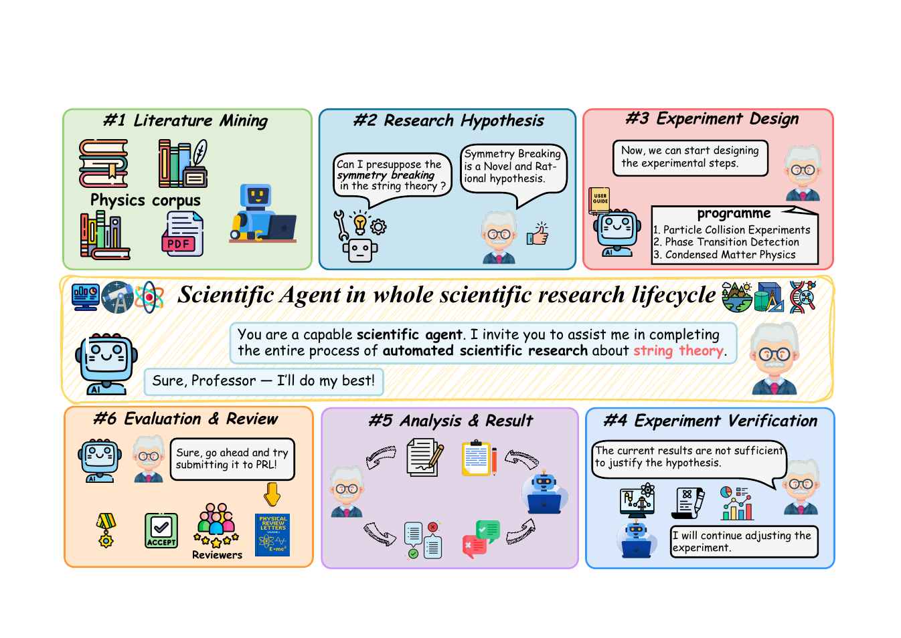
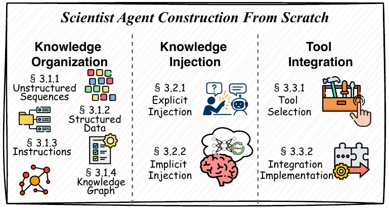
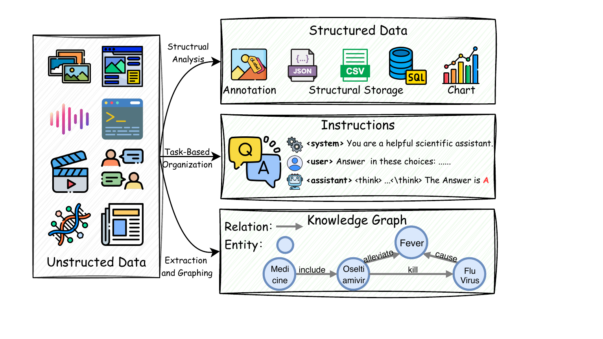
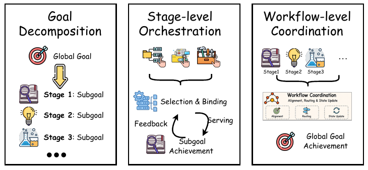
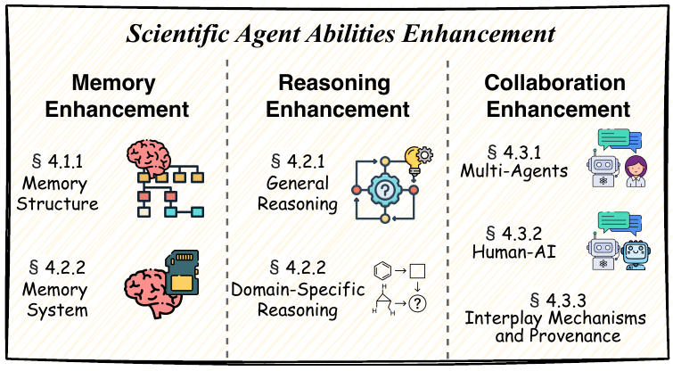
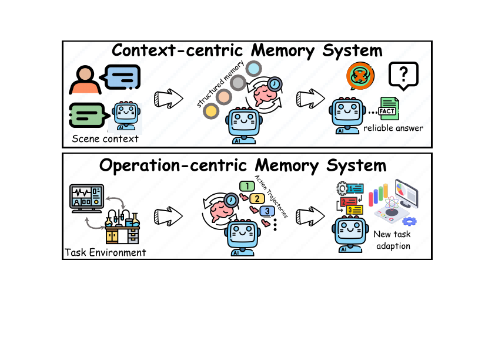
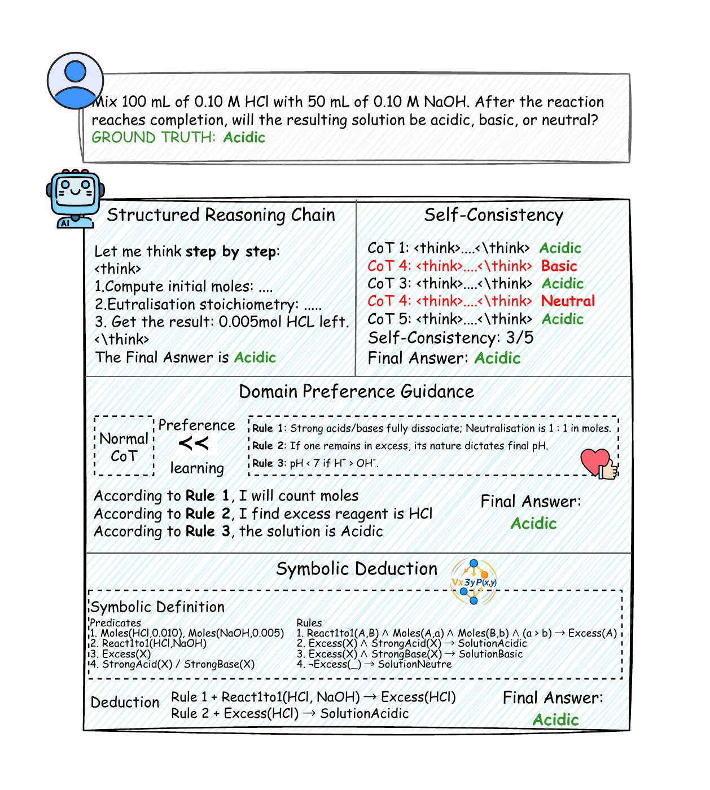
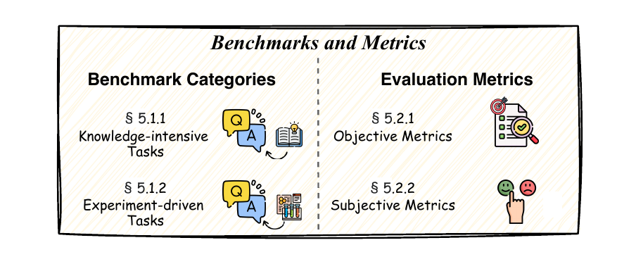

<div align="center">

# Awesome Scientific Agent

**A curated map of LLM-based agents for automated scientific research.**

[](#overview)
[](#taxonomy)
[](#benchmarks)
[](#auto-research-watchlist)
[](./LICENSE)

[Overview](#overview) • [Taxonomy](#taxonomy) • [Methods](#method-guides) • [Agentic Repos](#auto-research-watchlist) • [Construction](#construction) • [Enhancement](#enhancement) • [Benchmarks](#benchmarks) • [Citation](#citation)

</div>

<a id="overview"></a>

## ✨ Overview

Large language model agents are becoming a practical interface for AI for Science (AI4S): reading literature, generating hypotheses, designing experiments, operating tools, analyzing results, and reviewing research outputs. This repository organizes the scientific-agent landscape around the research workflow and the autonomy level of each system.

| What this repository maps | How to read it |
| --- | --- |
| **Agent levels** | Assistant, Partner, and Avatar describe increasing autonomy and responsibility in scientific workflows. |
| **Research stages** | Literature, Hypothesis, Design, Verification, Analysis, and Evaluation show where each method contributes. |
| **Agent components** | Reasoning, memory, and collaboration enhancements highlight how systems are built beyond a base LLM. |
| **Evaluation resources** | Benchmarks and datasets help compare scientific-agent capabilities across domains. |



<a id="reading-map"></a>

## 📖 Reading Map

| Section | Use it for |
| --- | --- |
| [💡 Taxonomy](#taxonomy) | Compare representative scientific agents by level, domain, backbone, capability, components, and research stage. |
| [🧩 Method Guides](#method-guides) | Read focused method notes for construction, enhancement, evaluation, and auto-research systems. |
| [✈️ Scientific Agents Construction](#construction) | Find papers and systems about building agent workflows, prompts, tools, context, and domain interfaces. |
| [🚀 Scientific Agents Enhancement](#enhancement) | Explore reasoning, memory, workflow, and self-improvement techniques for stronger agents. |
| [⚖️ Benchmark For Scientific Agents](#benchmarks) | Locate benchmarks for scientific reasoning, code generation, data analysis, citation, and domain evaluation. |
| [🧭 Broader Agentic & Auto-Research Repositories](#auto-research-watchlist) | Track influential repositories beyond scientific agents, including Karpathy-style training stacks, coding agents, browser agents, and orchestration frameworks. |

<a id="survey-figures"></a>

## 🖼️ Survey Figure Index

The figures below are synchronized from the TPAMI survey materials so the repository mirrors the paper's structure rather than acting only as a paper list.

| Figure | What it explains | Repository file |
| --- | --- | --- |
| Research lifecycle | How scientific agents support literature, hypothesis, design, verification, analysis, and evaluation. | [overall_short.png](./figures/overall_short.png) |
| Survey organization | High-level organization of the survey and repository map. | [overall.png](./figures/overall.png) |
| E/M role taxonomy | Capability envelope and capability maturity, inducing Assistant, Partner, and Avatar roles. | [level.png](./figures/level.png) |
| Extended role view | Additional role-level view used by the survey materials. | [level_2.png](./figures/level_2.png) |
| Construction overview | Agent construction methodology. | [construction_overview.png](./figures/construction_overview.png) |
| Knowledge organization | How scientific agents organize domain knowledge. | [knowledge_organization.png](./figures/knowledge_organization.png) |
| Orchestration | Coordination and workflow orchestration in scientific-agent construction. | [orchestration_flat.png](./figures/orchestration_flat.png) |
| Enhancement overview | Overview of scientific-agent capability enhancement. | [enhancement_overview.png](./figures/enhancement_overview.png) |
| Memory systems | Memory structures for scientific agents. | [memory.png](./figures/memory.png) |
| Reasoning enhancement | Reasoning enhancement patterns for scientific agents. | [reasoning.png](./figures/reasoning.png) |
| Benchmark overview | Scientific-agent benchmark and evaluation metric landscape. | [benchmark_overview.png](./figures/benchmark_overview.png) |

<a id="taxonomy"></a>

## 💡 Taxonomy


<!-- taxonomy-table:start -->
### Taxonomy Dashboard

| Level | Role in scientific work | Count | Typical scope |
| --- | --- | ---: | --- |
| **Assistant** | Helps with bounded scientific tasks under direct human steering. | 33 | Literature synthesis, QA, molecule or protein design assistance, analysis support. |
| **Partner** | Collaborates across multiple workflow steps with stronger tool use or feedback loops. | 19 | Multi-agent ideation, experiment planning, automation, review, and domain reasoning. |
| **Avatar** | Acts as a higher-autonomy research executor in digital or physical environments. | 13 | Robotic labs, autonomous discovery loops, long-horizon experimentation, and end-to-end research. |

| Capability / component | Meaning |
| --- | --- |
| **E** | Capability envelope: the breadth of scientific workflow coverage. |
| **M** | Capability maturity: the maturity of autonomy and execution. |
| **R / Mem. / C** | Reasoning enhancement, memory enhancement, and collaboration enhancement. |
| **Stages** | Literature, Hypothesis, Design, Verification, Analysis, and Evaluation. |

<details open>
<summary><b>Full taxonomy table</b> - 65 scientific agents across levels, domains, capabilities, components, and research stages</summary>

Capability envelope is abbreviated as `E`, capability maturity as `M`, reasoning enhancement as `R`, memory enhancement as `Mem.`, and collaboration enhancement as `C`. Application stages follow the scientific research workflow: Literature, Hypothesis, Design, Verification, Analysis, and Evaluation.

| Level | Method | Domain | LLM Backbone | E | M | R | Mem. | C | Application Stages | Task Description |
| --- | --- | --- | --- | --- | --- | --- | --- | --- | --- | --- |
| Assistant | LitLLM | General | General-purpose | E1 | M1 | No | No | No | Literature, Analysis | Literature review synthesis |
| Assistant | otto-SR | Medical | General-purpose | E1 | M1 | Yes | No | No | Literature, Analysis | Systematic review synthesis |
| Assistant | SciMON | General | General-purpose | E1 | M1 | Yes | No | No | Literature, Hypothesis | Novel hypothesis generation |
| Assistant | KG-FM | Materials | General-purpose | E1 | M1 | Yes | No | No | Literature, Hypothesis, Analysis | Knowledge-grounded materials QA |
| Assistant | HypoGen | General | General-purpose | E1 | M1 | Yes | No | No | Hypothesis | Research hypothesis generation |
| Assistant | LLM-SR | Physics | General-purpose | E1 | M1 | Yes | Yes | No | Hypothesis, Analysis | Symbolic equation discovery |
| Assistant | InstructMol | Chemistry | Domain-specialized | E1 | M1 | No | No | No | Verification, Analysis | Molecular instruction following |
| Assistant | GeneGPT | Medical | General-purpose | E1 | M1 | Yes | No | No | Analysis | Genomic question answering |
| Assistant | TAIS | Medical | General-purpose | E1 | M1 | Yes | No | Yes | Verification, Analysis | Gene expression analysis |
| Assistant | DrugAgent | Medical | General-purpose | E1 | M1 | Yes | No | Yes | Analysis | ML-driven drug discovery |
| Assistant | DrugGen | Medical | General-purpose | E1 | M1 | No | No | No | Design, Verification | Targeted molecular generation |
| Assistant | ChemAgent | Chemistry | General-purpose | E1 | M1 | Yes | Yes | No | Design, Verification, Analysis | Multi-step chemical reasoning |
| Assistant | ChatChemTS | Chemistry | Domain-specialized | E1 | M1 | No | No | No | Design, Verification | Conversational molecule generation |
| Assistant | PaperQA | General | General-purpose | E1 | M2 | Yes | Yes | No | Literature, Analysis | Scientific document QA |
| Assistant | ChatCite | General | General-purpose | E1 | M2 | Yes | Yes | No | Literature, Analysis | Evidence-aware literature synthesis |
| Assistant | CoI-Agent | General | General-purpose | E1 | M2 | Yes | Yes | No | Literature, Hypothesis | Chain-structured ideation |
| Assistant | Deep Ideation | General | General-purpose | E1 | M2 | Yes | Yes | No | Hypothesis, Analysis | Concept-network ideation |
| Assistant | IRIS | General | General-purpose | E1 | M2 | Yes | No | Yes | Hypothesis, Analysis | Interactive hypothesis search |
| Assistant | LlaSMol | Chemistry | Domain-specialized | E1 | M2 | Yes | No | No | Verification | Molecular design assistance |
| Assistant | Ether0 | Chemistry | Domain-specialized | E1 | M2 | Yes | No | No | Design, Verification | Complex molecular design |
| Assistant | ChemCrow | Chemistry | General-purpose | E1 | M2 | Yes | No | No | Literature, Design, Verification | Tool-augmented chemistry assistance |
| Assistant | HoneyComb | Materials | General-purpose | E1 | M2 | Yes | No | Yes | Literature, Design, Verification | Materials design assistance |
| Assistant | PaperCoder | Computer Science | General-purpose | E1 | M2 | Yes | No | Yes | Literature, Design, Verification | Paper-to-code generation |
| Assistant | BioResearcher | Biomedical | General-purpose | E2 | M1 | Yes | No | No | Literature, Hypothesis, Design, Verification, Analysis | Biological workflow assistance |
| Assistant | ProtAgents | Biology | General-purpose | E2 | M1 | Yes | No | Yes | Hypothesis, Design, Verification | Protein design loop |
| Assistant | MOOSE-Chem | Chemistry | General-purpose | E2 | M1 | No | Yes | No | Hypothesis, Verification | Chemical hypothesis generation |
| Assistant | Meta-OpenFoam | Physics | General-purpose | E2 | M1 | Yes | No | Yes | Design, Verification, Analysis | CFD workflow orchestration |
| Assistant | FoamAgent | Physics | General-purpose | E2 | M1 | Yes | No | Yes | Design, Verification, Analysis | Natural-language CFD execution |
| Assistant | PiFlow | General | General-purpose | E2 | M1 | Yes | No | Yes | Hypothesis, Design, Verification, Analysis | Principle-guided experiment loops |
| Assistant | DrBioRight 2.0 | Biology | General-purpose | E2 | M1 | Yes | No | No | Verification, Analysis | Bioinformatics workflow analysis |
| Assistant | OriGene | Medical | General-purpose | E2 | M1 | Yes | Yes | Yes | Hypothesis, Verification, Analysis | Target discovery and validation |
| Assistant | CellVoyager | Biology | General-purpose | E2 | M1 | Yes | No | No | Hypothesis, Design, Verification, Analysis | Autonomous scRNA-seq analysis |
| Assistant | VASPilot | Materials | General-purpose | E2 | M1 | Yes | No | Yes | Design, Verification | Autonomous DFT execution |
| Partner | DARWIN 1.5 | Biology/Chemistry | General-purpose | E2 | M2 | No | No | No | Literature, Verification, Analysis | Domain reasoning and analysis |
| Partner | Crispr-GPT | Biology | General-purpose | E2 | M2 | Yes | Yes | No | Hypothesis, Design, Evaluation | CRISPR design assistance |
| Partner | Chemma | Chemistry | General-purpose | E2 | M2 | Yes | No | No | Literature, Hypothesis, Design | Property-guided synthesis planning |
| Partner | MRAgent | Medical | General-purpose | E2 | M2 | Yes | No | No | Literature, Design, Verification, Analysis | MR-based medical inference |
| Partner | Aviary | Hybrid | General-purpose | E2 | M2 | Yes | No | No | Literature, Hypothesis, Design, Verification, Analysis | General scientific assistance |
| Partner | Virtual Lab | General | General-purpose | E2 | M2 | Yes | No | Yes | Literature, Hypothesis, Design, Verification, Analysis, Evaluation | PI-guided virtual experimentation |
| Partner | DeepRare | Medicine | General-purpose | E2 | M2 | Yes | Yes | Yes | Literature, Hypothesis, Analysis, Evaluation | Rare-disease differential diagnosis |
| Partner | MatPilot | Materials | General-purpose | E2 | M2 | Yes | No | Yes | Literature, Hypothesis, Design, Verification, Analysis | Language-driven materials design |
| Partner | SciToolAgent | General | General-purpose | E2 | M2 | Yes | No | Yes | Literature, Hypothesis, Design, Verification, Analysis | Tool-grounded scientific reasoning |
| Partner | Organa | Chemistry | General-purpose | E2 | M2 | No | No | No | Design, Verification | Human-guided robotic chemistry |
| Partner | FunSearch | Mathematics | General-purpose | E2 | M2 | Yes | Yes | No | Hypothesis, Design, Analysis | Evolutionary mathematical discovery |
| Partner | StarWhisper | Astronomy | General-purpose | E2 | M2 | Yes | Yes | Yes | Design, Verification | Autonomous telescope operations |
| Partner | CycleResearcher | Computer Science | General-purpose | E2 | M2 | Yes | No | Yes | Literature, Hypothesis, Evaluation | Iterative paper improvement |
| Partner | Biomni | Biology | General-purpose | E2 | M2 | Yes | Yes | Yes | Literature, Hypothesis, Design, Verification, Analysis | Broad biological automation |
| Partner | SciAgents | General | General-purpose | E2 | M2 | Yes | Yes | Yes | Literature, Hypothesis, Analysis | KG-guided scientific discovery |
| Partner | AI Scientist | Computer Science | General-purpose | E3 | M1 | No | No | No | Hypothesis, Design, Verification, Analysis, Evaluation | End-to-end CS research |
| Partner | AI-Researcher | Computer Science | General-purpose | E3 | M1 | Yes | No | Yes | Literature, Hypothesis, Analysis, Evaluation | End-to-end research assistance |
| Partner | Agentrxiv | Computer Science | General-purpose | E3 | M1 | Yes | Yes | Yes | Literature, Hypothesis, Verification, Analysis | Preprint-grounded agent research |
| Partner | Agent Laboratory | Computer Science | General-purpose | E3 | M1 | Yes | Yes | Yes | Literature, Hypothesis, Design, Analysis, Evaluation | End-to-end CS experimentation |
| Avatar | A-Lab | Materials | General-purpose | E2 | M3 | No | Yes | No | Literature, Hypothesis, Design, Verification, Analysis | Autonomous materials synthesis |
| Avatar | AlphaEvolve | General | General-purpose | E2 | M3 | Yes | Yes | No | Hypothesis, Design, Verification | Evolutionary scientific optimization |
| Avatar | OpenEvidence | Medicine | Domain-specialized | E2 | M3 | Yes | No | No | Literature, Analysis, Evaluation | Point-of-care clinical decision |
| Avatar | AILA | Materials | General-purpose | E2 | M3 | Yes | No | Yes | Design, Verification, Analysis | Autonomous instrument operation |
| Avatar | MOSAIC-chemistry | Chemistry | General-purpose | E2 | M3 | Yes | No | Yes | Design, Verification, Analysis | Collective synthesis planning |
| Avatar | MARS | Materials | General-purpose | E2 | M3 | Yes | No | Yes | Literature, Hypothesis, Design, Verification, Analysis | Robotic materials discovery |
| Avatar | ScienceOne | Biology | Domain-specialized | E3 | M2 | Yes | Yes | Yes | Literature, Hypothesis, Design, Verification, Analysis, Evaluation | End-to-end scientific automation |
| Avatar | AI co-scientist | General | General-purpose | E3 | M2 | Yes | Yes | Yes | Literature, Hypothesis, Design, Verification, Analysis | Multi-agent scientific co-discovery |
| Avatar | AI Scientist-v2 | Computer Science | General-purpose | E3 | M2 | Yes | No | No | Hypothesis, Design, Verification, Analysis, Evaluation | Workshop-level CS research |
| Avatar | Coscientist | Chemistry | General-purpose | E3 | M2 | Yes | No | No | Literature, Hypothesis, Design, Verification, Analysis | Autonomous chemistry execution |
| Avatar | Robin | Biology | General-purpose | E3 | M2 | Yes | Yes | Yes | Literature, Hypothesis, Design, Verification, Analysis, Evaluation | Multi-agent biological discovery |
| Avatar | Sparks | Biology | General-purpose | E3 | M2 | Yes | Yes | Yes | Hypothesis, Design, Verification, Analysis, Evaluation | Multi-agent protein design |
| Avatar | InternAgent-1.5 | General | Domain-specialized | E3 | M2 | Yes | Yes | Yes | Literature, Hypothesis, Design, Verification, Analysis | Long-horizon scientific discovery |

</details>
<!-- taxonomy-table:end -->

### Level 1: Agent As Assistant

<details open>
<summary><b>Level 1: Agent as Assistant - bounded task support and domain-specific assistance</b></summary>

- **AstroLLaMA‑Chat: Scaling AstroLLaMA with Conversational and Diverse Datasets** — [](https://arxiv.org/abs/2401.01916)
- **BioGPT: Generative Pre‑trained Transformer for Biomedical Text Generation and Mining** — [](https://arxiv.org/abs/2210.10341)
- **DARWIN 1.5: Large Language Models as Materials‑Science Foundation Models** — [](https://arxiv.org/abs/2412.11970)
- **ChemBERTa: Large‑Scale Self‑Supervised Pre‑training for Molecular Property Prediction** — [](https://arxiv.org/abs/2010.09885)
- **ChemAU: Harness the Reasoning of LLMs in Chemical Research with Adaptive Uncertainty Estimation** — [](https://arxiv.org/abs/2506.01116)
- **ChemDFM: A Large Language Foundation Model for Chemistry** — [](https://arxiv.org/abs/2401.14818)
- **LlaSMol: Advancing Large Language Models for Chemistry with a Large‑Scale, Comprehensive, High‑Quality Instruction Tuning Dataset** — [](https://arxiv.org/abs/2402.09391)
- **InstructMol: Multi‑modal Integration for Building a Versatile and Reliable Molecular Assistant in Drug Discovery** — [](https://arxiv.org/abs/2311.16208)
- **ether0: A Scientific Reasoning Model for Chemistry** — [](https://arxiv.org/abs/2506.17238)
- **Leveraging Large Language Models for Predictive Chemistry** — [](https://www.nature.com/articles/s42256-023-00788-1) 
- **Multi‑modal Molecule Structure–Text Model for Text‑based Retrieval and Editing** — [](https://www.nature.com/articles/s42256-023-00759-6)
- **ClimateGPT: Towards AI Synthesizing Interdisciplinary Research on Climate Change** — [](https://arxiv.org/abs/2401.09646)
- **Sparks of Science: Hypothesis Generation Using Structured Paper Data** — [](https://arxiv.org/abs/2504.12976)
- **DeepSeek‑Prover‑V2: Advancing Formal Mathematical Reasoning via Reinforcement Learning for Subgoal Decomposition** — [](https://arxiv.org/abs/2504.21801)
- **BiMediX: Bilingual Medical Mixture of Experts LLM** — [](https://arxiv.org/abs/2402.13253)
- **ChatDoctor: A Medical Chat Model Fine‑tuned on a Large Language Model (LLAMA) Using Medical Domain Knowledge** — [](https://arxiv.org/abs/2303.14070)
- **AgentMD: Empowering Language Agents for Risk Prediction with Large‑Scale Clinical Tool Learning** — [](https://arxiv.org/abs/2402.13225)
- **MedAlpaca: An Open‑Source Collection of Medical Conversational AI Models and Training Data** — [](https://arxiv.org/abs/2304.08247)
- **DrugGen Enhances Drug Discovery with Large Language Models and Reinforcement Learning** — [](https://www.nature.com/articles/s41598-025-98629-1) 
- **LLM‑SR: Scientific Equation Discovery via Programming with Large Language Models** — [](https://arxiv.org/abs/2404.18400)
- **LitLLM: A Toolkit for Scientific Literature Review** — [](https://arxiv.org/abs/2402.01788)
- **SciBERT: A Pretrained Language Model for Scientific Text** — [](https://arxiv.org/abs/1903.10676)
- **SciMON: Scientific Inspiration Machines Optimized for Novelty** — [](https://arxiv.org/abs/2305.14259)
- **SCITUNE: Aligning Large Language Models with Scientific Multimodal Instructions** — [](https://arxiv.org/abs/2307.01139)
- **NatureLM: Deciphering the Language of Nature for Scientific Discovery** — [](https://arxiv.org/abs/2502.07527)

</details>

### Level 2: Agent As Partner

<details open>
<summary><b>Level 2: Agent as Partner - multi-step collaboration and workflow orchestration</b></summary>

- **StarWhisper Telescope: Agent‑Based Observation Assistant System to Approach an AI Astrophysicist** — [](https://arxiv.org/abs/2412.06412)
- **From Intention to Implementation: Automating Biomedical Research via LLMs** — [](https://arxiv.org/abs/2412.09429)
- **CRISPR‑GPT: An LLM Agent for Automated Design of Gene‑Editing Experiments** — [](https://arxiv.org/abs/2404.18021)
- **Towards an AI Co‑Scientist** — [](https://arxiv.org/abs/2502.18864)
- **DrBioRight 2.0: An LLM‑Powered Bioinformatics Chatbot for Large‑Scale Cancer Functional Proteomics Analysis** — [](https://www.nature.com/articles/s41467-025-57430-4)
- **ProtAgents: Protein Discovery via Large Language Model Multi‑Agent Collaboration** — [](https://arxiv.org/abs/2402.04268)
- **MOOSE‑Chem: Large Language Models for Rediscovering Unseen Chemistry Scientific Hypotheses** — [](https://arxiv.org/abs/2410.07076)
- **Autonomous Chemical Research with Large Language Models** — [](https://www.nature.com/articles/s41586-023-06792-0)
- **ChemCrow: Augmenting Large‑Language Models with Chemistry Tools** — [](https://arxiv.org/abs/2304.05376)
- **ORGANA: A Robotic Assistant for Automated Chemistry Experimentation and Characterization** — [](https://arxiv.org/abs/2401.06949)
- **xChemAgents: Agentic AI for Explainable Quantum Chemistry** — [](https://arxiv.org/abs/2505.20574)
- **ChemAgent: Self‑Updating Memories in Large Language Models Improves Chemical Reasoning** — [](https://arxiv.org/abs/2501.06590)
- **Large Language Models to Accelerate Organic Chemistry Synthesis** — [](https://arxiv.org/abs/2504.18340)
- **MyCrunchGPT: A ChatGPT‑Assisted Framework for Scientific Machine Learning** — [](https://arxiv.org/abs/2306.15551)
- **MetaOpenFoam: An LLM‑Based Multi‑Agent Framework for CFD** — [](https://arxiv.org/abs/2407.21320)
- **FoamAgent: Towards Automated Intelligent CFD Workflows** — [](https://arxiv.org/abs/2505.04997)
- **AI‑Researcher: Autonomous Scientific Innovation** — [](https://arxiv.org/abs/2505.18705)
- **Jupybara: Operationalizing a Design Space for Actionable Data Analysis and Storytelling with LLMs** — [](https://arxiv.org/abs/2501.16661)
- **FlowAgent: Achieving Compliance and Flexibility for Workflow Agents** — [](https://arxiv.org/abs/2502.14345)
- **The AI Scientist: Towards Fully Automated Open‑Ended Scientific Discovery** — [](https://arxiv.org/abs/2408.06292)
- **GeoGPT: Understanding and Processing Geospatial Tasks through an Autonomous GPT** — [](https://arxiv.org/abs/2307.07930)
- **PaperQA: Retrieval‑Augmented Generative Agent for Scientific Research** — [](https://arxiv.org/abs/2312.07559)
- **ChatCite: LLM Agent with Human Workflow Guidance for Comparative Literature Summary** — [](https://arxiv.org/abs/2403.02574)
- **PiFlow: Principle‑Aware Scientific Discovery with Multi‑Agent Collaboration** — [](https://arxiv.org/abs/2505.15047)
- **Aviary: Training Language Agents on Challenging Scientific Tasks** — [](https://arxiv.org/abs/2412.21154)
- **An Autonomous Laboratory for the Accelerated Synthesis of Novel Materials** — [](https://pubmed.ncbi.nlm.nih.gov/38030721/)
- **Construction of a Knowledge Graph for Framework Material Enabled by Large Language Models and Its Application** — [](https://www.nature.com/articles/s41524-025-01540-6)
- **MultiCrossModal Automated Agent for Integrating Diverse Materials Science Data** — [](https://arxiv.org/abs/2505.15132)
- **LLMatDesign: Autonomous Materials Discovery with Large Language Models** — [](https://arxiv.org/abs/2406.13163)
- **Honeycomb: A Flexible LLM‑Based Agent System for Materials Science** — [](https://arxiv.org/abs/2409.00135)
- **DrugAgent: Automating AI‑Aided Drug Discovery Programming through LLM Multi‑Agent Collaboration** — [](https://arxiv.org/abs/2411.15692)
- **Toward a Team of AI‑Made Scientists for Scientific Discovery from Gene Expression Data** — [](https://arxiv.org/abs/2402.12391)
- **MedAgents: Large Language Models as Collaborators for Zero‑Shot Medical Reasoning** — [](https://arxiv.org/abs/2311.10537)
- **Automation of Systematic Reviews with Large Language Models** — [](https://www.medrxiv.org/content/10.1101/2025.06.13.25329541v2)
- **MRAgent: An LLM‑Based Automated Agent for Causal Knowledge Discovery in Disease via Mendelian Randomization** — [](https://academic.oup.com/bib/article/26/2/bbaf140/8107848)
- **GeneGPT: Augmenting Large Language Models with Domain Tools for Improved Access to Biomedical Information** — [](https://arxiv.org/abs/2304.09667)

</details>

### Level 3: Agent As Avatar

<details open>
<summary><b>Level 3: Agent as Avatar - autonomous research execution and long-horizon discovery</b></summary>

- **CycleResearcher: Improving Automated Research via Automated Review** — [](https://arxiv.org/abs/2411.00816)
- **The AI Scientist‑v2: Workshop‑Level Automated Scientific Discovery via Agentic Tree Search** — [](https://arxiv.org/abs/2504.08066)
- **AgentRxiv: Towards Collaborative Autonomous Research** — [](https://arxiv.org/abs/2503.18102)
- **Agent Laboratory: Using LLM Agents as Research Assistants** — [](https://arxiv.org/abs/2501.04227)
- **BiOMNI: A General‑Purpose Biomedical AI Agent** — [](https://www.biorxiv.org/content/10.1101/2025.05.30.656746v1)
- **OriGene: A Self‑Evolving Virtual Disease Biologist Automating Therapeutic Target Discovery** — [](https://www.biorxiv.org/content/10.1101/2025.06.03.657658v1)
- **CellVoyager: AI CompBio Agent Generates New Insights by Autonomously Analyzing Biological Data** — [](https://www.biorxiv.org/content/10.1101/2025.06.03.657517v1)
- **Sparks: Multi‑Agent Artificial Intelligence Model Discovers Protein Design Principles** — [](https://arxiv.org/abs/2504.19017)
- **AlphaEvolve: A Coding Agent for Scientific and Algorithmic Discovery** — [](https://arxiv.org/abs/2506.13131)
- **Robin: A Multi‑Agent System for Automating Scientific Discovery** — [](https://arxiv.org/abs/2505.13400)
- **ScienceOne** —  [](https://scienceone.ia.ac.cn/)

</details>

<a id="method-guides"></a>

## 🧩 Method Guides

The root README keeps the curated map compact; the method guides provide deeper explanations for readers who want to understand how scientific agents are built, improved, evaluated, and connected to broader auto-research systems.

| Guide | What it covers |
| --- | --- |
| [Construction Methods](./methods/construction/README.md) | Knowledge organization, knowledge injection, tool integration, orchestration, and domain interfaces. |
| [Enhancement Methods](./methods/enhancement/README.md) | Reasoning, memory, collaboration, workflow search, and self-review. |
| [Evaluation Methods](./methods/evaluation/README.md) | Benchmark selection, executable evaluation, citation grounding, and long-horizon validation. |
| [Auto-Research Systems](./methods/auto-research/README.md) | End-to-end research loops, coding/browser agents, training resources, and orchestration frameworks. |

<a id="auto-research-watchlist"></a>

## 🧭 Broader Agentic & Auto-Research Repositories

Beyond scientific-agent papers, the broader agent ecosystem is moving quickly across model training, software engineering, web automation, and multi-agent orchestration. This watchlist keeps a lightweight bridge from the survey taxonomy to practical repositories that shape how autonomous research and agentic systems are built.

| Repository | Scope | Why follow it |
| --- | --- | --- |
| [karpathy/nanochat](https://github.com/karpathy/nanochat) | Minimal end-to-end LLM training and chat stack | Tracks Karpathy's compact, hackable path from tokenizer and pretraining to finetuning, evaluation, inference, and chat UI. |
| [karpathy/llm.c](https://github.com/karpathy/llm.c) | LLM training in C/CUDA | Useful for understanding low-level training kernels, performance constraints, and reproducible GPT-style training. |
| [SakanaAI/AI-Scientist](https://github.com/SakanaAI/AI-Scientist) | Automated idea-to-paper research loop | A reference point for autonomous ideation, coding, experimentation, paper writing, and automated review. |
| [SakanaAI/AI-Scientist-v2](https://github.com/SakanaAI/AI-Scientist-v2) | Agentic tree search for automated discovery | Follows the next iteration of AI Scientist with broader exploration and stronger end-to-end workflow design. |
| [SamuelSchmidgall/AgentLaboratory](https://github.com/SamuelSchmidgall/AgentLaboratory) | Human-guided autonomous research assistant | Shows how literature review, experimentation, and report writing can be composed into a full research workflow. |
| [NoviScl/AI-Researcher](https://github.com/NoviScl/AI-Researcher) | Research ideation and execution studies | Provides agent pipelines and human-study data for comparing LLM-generated ideas with expert research ideas. |
| [OpenHands/OpenHands](https://github.com/OpenHands/OpenHands) | AI software development agents | A generalist coding-agent platform for editing repositories, using terminals, browsing, and operating in sandboxed environments. |
| [SWE-agent/SWE-agent](https://github.com/SWE-agent/SWE-agent) | GitHub issue fixing and SWE-bench agents | A practical baseline for agentic software engineering, debugging, and repository-level task execution. |
| [huggingface/smolagents](https://github.com/huggingface/smolagents) | Lightweight code-agent framework | Good for studying minimal abstractions, code-as-action agents, sandboxed execution, and open-model agent workflows. |
| [microsoft/autogen](https://github.com/microsoft/autogen) | Agentic AI programming framework | Useful for multi-agent conversations, orchestration patterns, and prototyping collaborative agent systems. |
| [crewAIInc/crewAI](https://github.com/crewAIInc/crewAI) | Multi-agent orchestration | Focuses on role-based agents, task delegation, crews, flows, and production-style automation workflows. |
| [langchain-ai/langgraph](https://github.com/langchain-ai/langgraph) | Graph-based agent workflows | Useful for durable, stateful, controllable agent graphs and long-running workflow orchestration. |
| [FoundationAgents/MetaGPT](https://github.com/FoundationAgents/MetaGPT) | Multi-agent software company metaphor | A representative multi-agent framework for decomposing product/software work into role-specialized agents. |
| [browser-use/browser-use](https://github.com/browser-use/browser-use) | Browser automation for agents | Tracks web interaction patterns, browser control, and task automation over ordinary websites. |
| [Significant-Gravitas/AutoGPT](https://github.com/Significant-Gravitas/AutoGPT) | Early autonomous agent platform | Still useful as historical context for goal-directed agents, autonomous task decomposition, and agent productization. |

<a id="construction"></a>

## ✈️ Scientific Agents Construction

<p align="center">
  
</p>

<p align="center">
  
  
</p>

<details open>
<summary><b>Construction resources - prompts, context, tools, workflows, and domain interfaces</b></summary>

- **PromptAgent: Strategic Planning with Language Models Enables Expert-level Prompt Optimization** — [](https://arxiv.org/abs/2310.16427) 
- **Context Engineering: A Practical Handbook for Context Design, Orchestration, and Optimization** — [](https://github.com/davidkimai/Context-Engineering) 
- **Verl: Volcano Engine Reinforcement Learning for Large Language Models** — [](https://github.com/zjunlp/Verl)  
- **GraphRAG: A Modular Graph-Based Retrieval-Augmented Generation (RAG) System** — [](https://arxiv.org/abs/2311.06753)  
- **ChemCrow: Augmenting Large‑Language Models with Chemistry Tools** — [](https://arxiv.org/abs/2304.05376)  
- **Virtual Lab: AI Agents Design New SARS-CoV-2 Nanobodies with Experimental Validation** — [](https://www.biorxiv.org/content/10.1101/2024.11.11.623004v1)  
- **OctoTools: An Agentic Framework with Extensible Tools for Complex Reasoning** — [](https://arxiv.org/abs/2502.11271)  
- **FoamAgent: Towards Automated Intelligent CFD Workflows** — [](https://arxiv.org/abs/2505.04997)  
- **MetaOpenFoam: An LLM-Based Multi-Agent Framework for CFD** — [](https://arxiv.org/abs/2407.21320)  
- **AutoPrompt: Eliciting Knowledge from Language Models with Automatically Generated Prompts** — [](https://arxiv.org/abs/2010.15980)  
- **InstructBio: Instruction Tuning for Biomedical LLMs** — [](https://arxiv.org/abs/2310.19975)  
- **LangChain: Building Applications with LLMs through Composability** — [](https://github.com/langchain-ai/langchain)  
- **LightRAG: Simple and Fast Retrieval‑Augmented Generation** — [](https://arxiv.org/abs/2410.05779)  
- **SciTUNE: Aligning Large Language Models with Scientific Multimodal Instructions** — [](https://arxiv.org/abs/2307.01139)
- **ClimateGPT: Towards AI Synthesizing Interdisciplinary Research on Climate Change** — [](https://arxiv.org/abs/2401.09646)
- **SciMON: Scientific Inspiration Machines Optimized for Novelty** — [](https://arxiv.org/abs/2305.14259)
- **TAIS: Gene Expression Agent with LLMs** — [](https://arxiv.org/abs/2503.02973)
- **StarWhisper Telescope: Agent‑Based Observation Assistant System to Approach an AI Astrophysicist** — [](https://arxiv.org/abs/2412.06412)

</details>

<a id="enhancement"></a>

## 🚀 Scientific Agents Enhancement

<p align="center">
  
</p>

<p align="center">
  
  
</p>

<details open>
<summary><b>Enhancement resources - reasoning, memory, workflow search, reflection, and collaboration</b></summary>

- **MemGPT: Toward LLMs as Operating Systems** — [](https://arxiv.org/abs/2310.08560) 
- **AFlow: Automating Agentic Workflow Generation** — [](https://arxiv.org/abs/2410.10762)  
- **ChemAgent: Self‑Updating Memories in Large Language Models Improves Chemical Reasoning** — [](https://arxiv.org/abs/2501.06590)  
- **DeepSeek‑Prover‑V2: Advancing Formal Mathematical Reasoning** — [](https://arxiv.org/abs/2504.21801)  
- **LLM‑SR: Scientific Equation Discovery via Programming with LLMs** — [](https://arxiv.org/abs/2404.18400)  
- **Sparks: Multi‑Agent Artificial Intelligence Model Discovers Protein Design Principles** — [](https://arxiv.org/abs/2504.19017)  
- **ether0: A Scientific Reasoning Model for Chemistry** — [](https://arxiv.org/abs/2506.17238)  
- **Robin: A Multi‑Agent System for Automating Scientific Discovery** — [](https://arxiv.org/abs/2505.13400)  
- **AgentRxiv: Towards Collaborative Autonomous Research** — [](https://arxiv.org/abs/2503.18102)  
- **ChatGPT Research Group for Optimizing the Crystallinity of MOFs and COFs** — [](https://doi.org/10.1021/acscentsci.3c00765)  
- **AI Co-Scientist: Towards an AI Co-Scientist** — [](https://arxiv.org/abs/2502.18864)  
- **ReAct: Synergizing Reasoning and Acting in Language Models** — [](https://arxiv.org/abs/2210.03629)  
- **Reflexion: Language Agents with Verbal Reinforcement Learning** — [](https://arxiv.org/abs/2303.11366)  
- **Self‑Refine: Iterative Self‑Improvement with Self‑Feedback** — [](https://arxiv.org/abs/2306.11382)  
- **Self‑Consistency: Reliable Decoding for Complex Reasoning** — [](https://arxiv.org/abs/2203.11171)  
- **AquilaChat: Agent with Long-Context Scratchpad Memory** — [](https://arxiv.org/abs/2403.00220)

</details>

<a id="benchmarks"></a>

## ⚖️ Benchmark For Scientific Agents

Use this section as an evaluation map rather than a flat benchmark list. The resources below cover different failure modes of scientific agents: domain knowledge, executable experiments, citation grounding, data analysis, and long-horizon discovery.

<p align="center">
  
</p>

| Evaluation angle | Representative focus | Useful when you need to test... |
| --- | --- | --- |
| **Scientific knowledge and reasoning** | BioMaze, SuperGPQA, Humanity's Last Exam, MR-Ben | Whether an agent can reason over expert-level scientific concepts. |
| **Citation and literature grounding** | CiteBench, ALCE, SurveyForge | Whether outputs are traceable, evidence-aware, and literature-faithful. |
| **Code, data, and experiment execution** | MLAgentBench, DSBench, SciCode, PaperBench | Whether an agent can implement, run, debug, and reproduce research workflows. |
| **Domain and embodied environments** | DiscoveryWorld, AgentClinic, GenoTEX, LLM-SRBench | Whether an agent performs in domain-specific or simulated scientific settings. |

<details open>
<summary><b>Benchmark resources - evaluation suites for scientific reasoning, data analysis, citation, coding, and agentic discovery</b></summary>

- **BioMaze: Benchmarking and Enhancing Large Language Models for Biological Pathway Reasoning** — [](https://arxiv.org/abs/2502.16660) [](https://huggingface.co/datasets/haitengzhao/BioMaze)
- **BioKGBench: A Knowledge Graph Checking Benchmark of AI Agent for Biomedical Science** — [](https://github.com/westlake-autolab/BioKGBench)
- **SurveyForge: On the Outline Heuristics, Memory-Driven Generation, and Multi-Dimensional Evaluation for Automated Survey Writing** — [](https://arxiv.org/abs/2503.04629) [](https://github.com/Alpha-Innovator/SurveyForge)
- **MMLU-Pro: A More Robust and Challenging Multi-Task Language Understanding Benchmark** — [](https://proceedings.neurips.cc/paper/2024) [](https://huggingface.co/datasets/TIGER-Lab/MMLU-Pro)
- **Humanity's Last Exam: A Hard Benchmark at the Frontier of Human Knowledge** — [](https://arxiv.org/abs/2501.14249) [](https://lastexam.ai/)
- **SuperGPQA: Scaling LLM Evaluation Across 285 Graduate Disciplines** — [](https://arxiv.org/abs/2502.14739)[](https://huggingface.co/datasets/m-a-p/SuperGPQA) 
- **CiteBench: A Benchmark for Scientific Citation Text Generation** — [](https://arxiv.org/abs/2212.09577) [](https://github.com/UKPLab/citebench)
- **ALCE: Enabling Large Language Models to Generate Text With Citations** — [](https://arxiv.org/abs/2305.14627) [](https://github.com/princeton-nlp/ALCE)
- **Tomato-Chem: Large Language Models for Rediscovering Unseen Chemistry Scientific Hypotheses** — [](https://arxiv.org/abs/2410.07076) [](https://github.com/ZonglinY/MOOSE-Chem)
- **Reviewer2: Optimizing Review Generation Through Prompt Generation** — [](https://arxiv.org/abs/2402.10886) [](https://github.com/ZhaolinGao/Reviewer2)
- **Scientists' First Exam: Probing Cognitive Abilities of MLLM via Perception, Understanding, and Reasoning** — [](https://huggingface.co/datasets/PrismaX/SFE) [](https://arxiv.org/)
- **MR-Ben: A Comprehensive Meta-Reasoning Benchmark for Large Language Models** — [](https://arxiv.org/abs/2406.13975) [](https://randolph-zeng.github.io/Mr-Ben.github.io/)
- **FigureQA: An Annotated Figure Dataset for Visual Reasoning** — [](https://arxiv.org/abs/1710.07300) [](https://huggingface.co/datasets/vikhyatk/figureqa)
- **SciEval: A Multi-Level Large Language Model Evaluation Benchmark for Scientific Research** — [](https://ojs.aaai.org/index.php/AAAI/article/view/30700) [](https://huggingface.co/datasets/OpenDFM/SciEval)
- **MedXpertQA: Benchmarking Expert-Level Medical Reasoning and Understanding** — [](https://arxiv.org/abs/2501.18362) [](https://huggingface.co/datasets/bigbio/med_qa)
- **LLM-SRBench: A New Benchmark for Scientific Equation Discovery With Large Language Models** — [](https://arxiv.org/abs/2504.10415) [](https://huggingface.co/datasets/nnheui/llm-srbench)
- **GenoTEX: A Benchmark for Evaluating LLM-Based Exploration of Gene Expression Data in Alignment With Bioinformaticians** — [](https://arxiv.org/abs/2406.15341) [](https://huggingface.co/datasets/Liu-Hy/GenoTEX)
- **MLAgentBench: Evaluating Language Agents on Machine Learning Experimentation** — [](https://arxiv.org/abs/2310.03302) [](https://github.com/snap-stanford/MLAgentBench)
- **PaperBench: Evaluating AI's Ability to Replicate AI Research** — [](https://arxiv.org/abs/2504.01848) [](https://openai.com/research/paperbench)
- **DSBench: A Realistic Benchmark for Data Science Code Generation** — [](https://arxiv.org/abs/2505.15621) [](https://github.com/LiqiangJing/DSBench)
- **DiscoveryWorld: A Virtual Environment for Developing and Evaluating Automated Scientific Discovery Agents** — [](https://arxiv.org/abs/2406.06769) [](https://github.com/allenai/discoveryworld)
- **SciCode: A Scientist-Curated Benchmark for Scientific Code Generation** — [](https://arxiv.org/abs/2407.13168) [](https://github.com/scicode-bench/SciCode)
- **AgentClinic: A Multimodal Agent Benchmark to Evaluate AI in Simulated Clinical Environments** — [](https://github.com/SamuelSchmidgall/AgentClinic) [](https://arxiv.org/)
- **SDRBench: Scientific Data Reduction Benchmark for Lossy Compressors** — [](https://sdrbench.github.io/) [](https://www.r-ccs.riken.jp/en/)
- **DSBench: How Far Are Data Science Agents from Becoming Data Science Experts?** — [](https://github.com/LiqiangJing/DSBench) [](https://arxiv.org/abs/2409.07703)

</details>

<a id="citation"></a>

## 🌞 Citation

```
@article{wang2025hitchhiker,
  title={The Hitchhiker's Guide to Autonomous Research: A Survey of Scientific Agents},
  author={Wang, Xinming and Xu, Jian and Feng, Aslan H and Chen, Yi and Guo, Haiyang and Zhu, Fei and Shao, Yuanqi and Ren, Minsi and Yi, Hongzhu and Lian, Sheng and others},
  year={2025}
}
```

